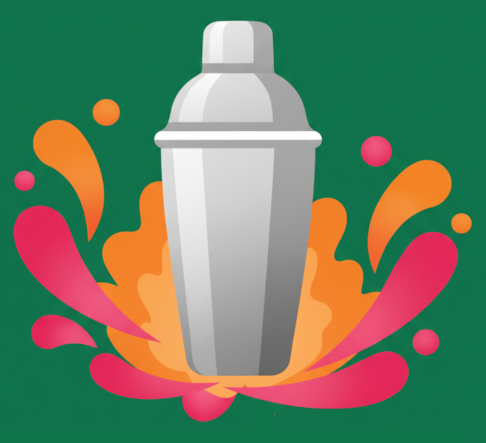

#    Mix It Up

A React Native cocktail app designed for party experimentation. Users can quickly discover cocktail recipes, filter by available spirits, and save favorites - perfect for beginners who want to try something new at parties.


## 🛠️ Tech Stack

- **React Native** + **Expo** - Cross-platform mobile development
- **React Navigation** - Screen navigation and modals
- **React Context** - State management for favorites system
- **TheCocktailDB API** - External API integration for recipe data
- **Expo SQLite ** - For data persistance
- **Custom Design System** - Themed components with consistent styling

## ✨ Key Features

- Search functionality for finding hundreds of cocktail recipes
- Smart filtering by spirits (Vodka, Gin, Tequila, etc.) and drink types
- Persistent favorites using React Context
- Modal-based UI for filters and favorites
- API integration with proper error handling
- Responsive design optimized for mobile

## 🏗️ Architecture Highlights

- **Modular component structure** with reusable UI elements
- **Clean separation of concerns** between data, screens, components, and context
- **Efficient API data management** with proper loading states
- **Cross-platform compatibility** tested on iOS and Android

## 🚀 Getting Started

```bash
npm install
npx expo start
